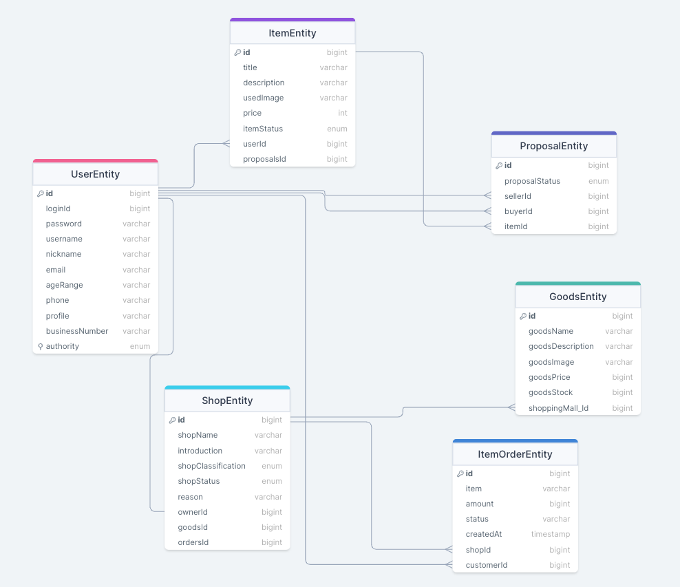

# Mission2 - Shopingmall

- 2024.02.22 ~ 03.05

<strong>ERD</strong>

---

## 스팩

- Spring Boot 3.2.2
- Spring Web
- Lombok
- Spring Data JPA
- SQLite
- jjwt
- Querydsl

---

## 프로젝트 구조 설명

- `auth`
: jwt를 이용하여 회원가입, 로그인 로직 구현

- `used`
: 중고 물품 거래 

- `proposal`
: 중고 물품을 구매하기 위해, 구매자가 판매자에게 구메 제안서를 보내는 방식

- `shopGoods`
: 일반 유저 중에서 사업자 신청을 한 비즈니스 계정이 쇼핑몰을 개설하고 상품 등록

- `purchase`
: 일반 사용자가 쇼핑몰의 상품을 검색하고 구매하는 방식 `(일부 기능 미구현)`

---

## 진행 상황

1. 기본과제 요구사항
- 사용자 인증 및 권한 처리: `auth`
- 중고거래 중개하기: `used`, `proposal`
- 쇼핑몰 운영하기: `shopGoods`, `purchase`

<strong> 1. 사용자 인증 및 권한 처리 </strong>

- 요청을 보낸 사용자가 누구인지 구분할 수 있는 인증 체계가 갖춰져야 한다. `완료`
  - JWT 기반의 토큰 인증 방식이 권장된다.
  - 사용자는 별도의 클라이언트를 통해 아이디와 비밀번호를 전달한다.
  - 로그인 URL로 아이디와 비밀번호가 전달되면, 해당 내용의 정당성을 확인하여 JWT를 발급하여 클라이언트에게 반환한다.
  - 클라이언트는 이후 이 JWT를 Bearer Authentication 방식으로 제시해야 한다.

- 사용자는 회원가입이 가능하다. `완료`
  - 아이디, 비밀번호를 제공하여 회원가입이 가능하다.
  - 서비스를 이용하려면 닉네임, 이름, 연령대, 이메일, 전화번호 정보를 추가해야 한다.
  - 사용자의 프로필 이미지가 업로드 가능하다.

- 사용자의 권한이 관리되어야 한다. `완료`
  - 네 종류의 사용자가 있다. (비활성 사용자, 일반 사용자, 사업자 사용자, 관리자)
  - 최초의 회원가입시 비활성 사용자로 가입된다.
  - 비활성 사용자가 서비스를 위한 필수 정보를 추가하면 일반 사용자로 자동으로 전환된다.
  - 일반 사용자는 자신의 사업자 등록번호(가정)을 전달해 사업자 사용자로 전환신청을 할 수 있다.
    - 사업자 등록번호는 실제 형식과 일치할 필요 없다.
  - 관리자는 사업자 사용자 전환 신청 목록을 확인할 수 있다.
  - 관리자는 사업자 사용자 전환 신청을 수락 또는 거절할 수 있다.
  - 관리자는 서비스와 상관없이 고정된 사용자이다.
    - 다른 회원가입 과정을 통해 만들어진 사용자는 관리자가 될 수 없다.

<strong>2. 중고거래 중개하기 </strong>

- 물품 등록 `이미지 등록 로직 리팩토링 필요`
  - 일반 사용자는 중고 거래를 목적으로 물품에 대한 정보를 등록할 수 있다.
    - 제목, 설명, 대표 이미지, 최소 가격이 필요하다.
      - 대표 이미지는 반드시 함께 등록될 필요는 없다.
      - 다른 항목은 필수이다.
      - 최초로 물품이 등록될 때, 중고 물품의 상태는 **판매중** 상태가 된다.
  - 등록된 물품 정보는 비활성 사용자를 제외 누구든지 열람할 수 있다.
    - ~~등록자의 광역자치단체 단위의 지역 정보가 같이 기재된다.~~
    - 사용자의 상세 정보는 공개되지 않는다.
  - 등록된 물품 정보는 작성자가 수정, 삭제가 가능하다.
  

- 구매 제안 `완료`
  - **물품을 등록한 사용자**와 **비활성 사용자** 제외, 등록된 물품에 대하여 구매 제안을 등록할 수 있다.
  - 등록된 구매 제안은 **물품을 등록한 사용자**와 **제안을 등록한 사용자**만 조회가 가능하다.
    - **제안을 등록한 사용자**는 자신의 제안만 확인이 가능하다.
    - **물품을 등록한 사용자**는 모든 제안이 확인 가능하다.
  - **물품을 등록한 사용자**는 ****등록된 구매 제안을 수락 또는 거절할 수 있다.
    - 이때 구매 제안의 상태는 **수락** 또는 **거절**이 된다.
  - **제안을 등록한 사용자**는 자신이 등록한 제안이 수락 상태일 경우, 구매 확정을 할 수 있다.
    - 이때 구매 제안의 상태는 **확정** 상태가 된다.
    - 구매 제안이 확정될 경우, 대상 물품의 상태는 **판매 완료**가 된다.
    - 구매 제안이 확정될 경우, 확정되지 않은 다른 구매 제안의 상태는 모두 **거절**이 된다.

<strong> 3. 쇼핑몰 운영하기 </strong>

- 쇼핑몰 개설 `완료`
  - 일반 사용자가 사업자 사용자로 전환될 때 **준비중** 상태의 쇼핑몰이 추가된다. 사업자 사용자는 이 쇼핑몰의 주인이 된다.
  - 쇼핑몰에는 이름, 소개, 분류의 정보를 가지고 있으며, 주인은 자유롭게 수정이 가능하다.
    - 분류의 종류는 서비스 제작자에 의해 미리 정해진다. (최소 5)
  - 쇼핑몰의 이름, 소개, 분류가 전부 작성된 상태라면 쇼핑몰을 개설 신청을 할 수 있다.
  - 관리자는 개설 신청된 쇼핑몰의 목록을 확인할 수 있으며, 정보를 확인후 허가 또는 불허 할 수 있다.
    - 불허 할 경우 그 이유를 함께 작성해야 한다.
    - 불허된 이유를 쇼핑몰의 주인이 확인할 수 있어야 한다.
  - 개설이 허가된 쇼핑몰을 **오픈** 상태가 된다.
  - 쇼핑몰 주인은 사유를 작성하여 쇼핑몰 폐쇄 요청을 할 수 있다.
    - 관리자는 쇼핑몰 폐쇄 요청을 확인 후 수락할 수 있다.

- 쇼핑몰 관리 `완료`
  - 쇼핑몰 주인은 쇼핑몰에 상품을 등록할 수 있다.
    - 필수적인 정보는 상품 이름, 상품 이미지, 상품 설명, 상품 가격, 상품 재고가 있다.
  - 쇼핑몰 주인은 등록한 상품을 수정할 수 있다.
  - 쇼핑몰 주인은 등록한 상품을 삭제할 수 있다.

- 쇼핑몰 조회 `완료`
  - 비활성 사용자를 제외한 사용자는 쇼핑몰을 조회할 수 있다.
    - 조건 없이 조회할 경우, 가장 최근에 거래가 있었던 쇼핑몰 순서로 조회된다.
    - 이름, 쇼핑몰 분류를 조건으로 쇼핑몰을 검색할 수 있다. 

- 쇼핑몰 상품 검색 `미구현`
  - 비활성 사용자를 제외한 사용자는 쇼핑몰의 상품을 검색할 수 있다.
    - 이름, 가격 범위를 기준으로 상품을 검색할 수 있다. 
    - 조회되는 상품이 등록된 쇼핑몰에 대한 정보가 함께 제공되어야 한다.

- 쇼핑몰 상품 구매 `미구현`
  - 비활성 사용자를 제외한 사용자는 쇼핑몰의 상품을 구매할 수 있다.
    - 상품과 구매 수량을 기준으로 구매 요청을 할 수 있다.
    - 구매 요청 후 사용자는 구매에 필요한 금액을 전달한다고 가정한다.
    - 주인이 전달된 금액을 확인하면 구매 요청을 수락할 수 있다.
    - 구매 요청이 수락되면, 상품 재고가 자동으로 갱신된다. 이후엔 구매 취소가 불가능하다.
    - 구매 요청이 수락되기 전에는 구매 요청을 취소할 수 있다.

---

## Index

- [프로젝트 요구 사항](projectGuide.md)
- [Postman](shoppingmall.postman_collection.json)
- [Key Point]()
- [Trouble Shooting]()

